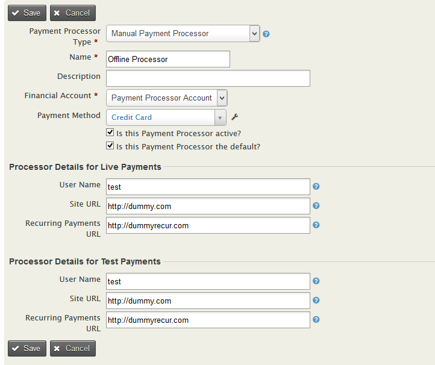
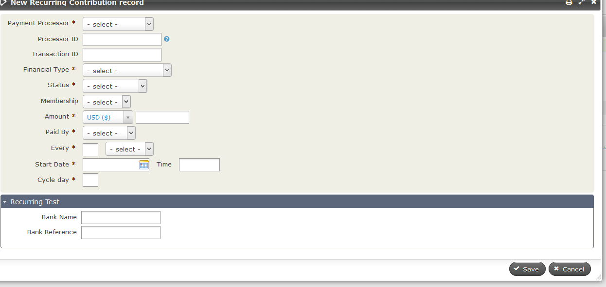
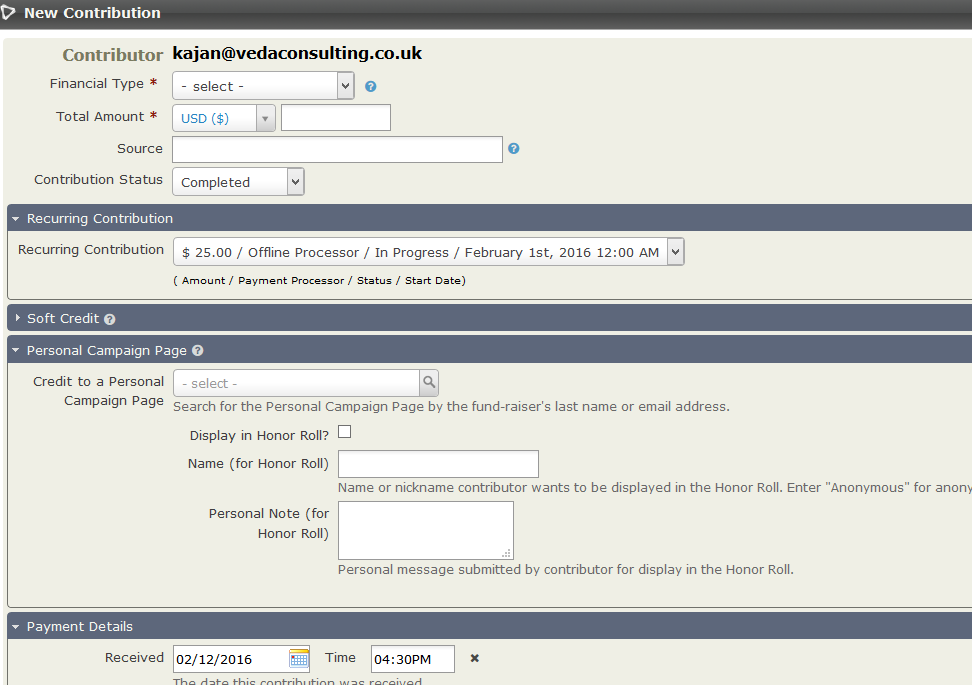

# Offline recurring feature to CiviCRM  #

### Overview ###

This extension adds offline feature to existing online recurring

### Installation ###

* Install the extension manually in CiviCRM. More details [here](http://wiki.civicrm.org/confluence/display/CRMDOC/Extensions#Extensions-Installinganewextension) about installing extensions in CiviCRM.

### Usage ###
* Check 'Recurring Contribution' in 'Display Preferences' (civicrm/admin/setting/preferences/display?reset=1)
* Create payment processor type of 'Manual' 

* Create offline recurring using 'Set Up Recurring Contribution' button in 'Recurring Contribution' tab  

* Create contribution using above recurring 

* Create custom fields with type of 'Recurring Contributions', which will show up in creating new recurring record

### Support ###

support (at) vedaconsulting.co.uk
